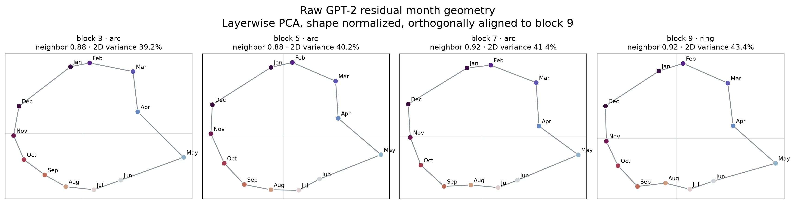
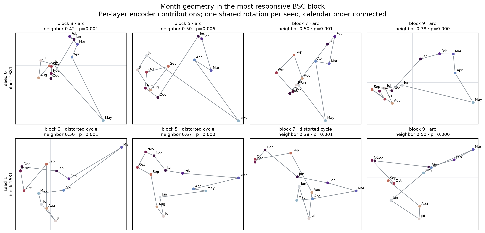
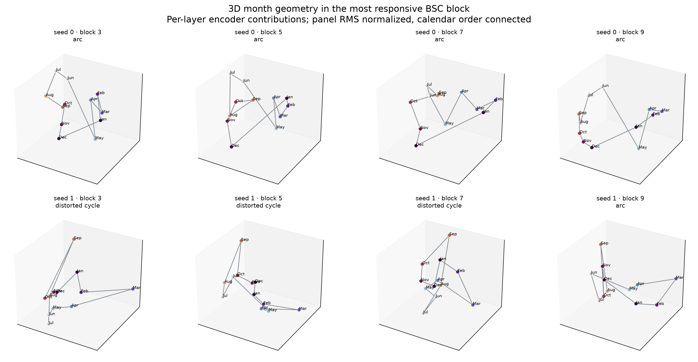
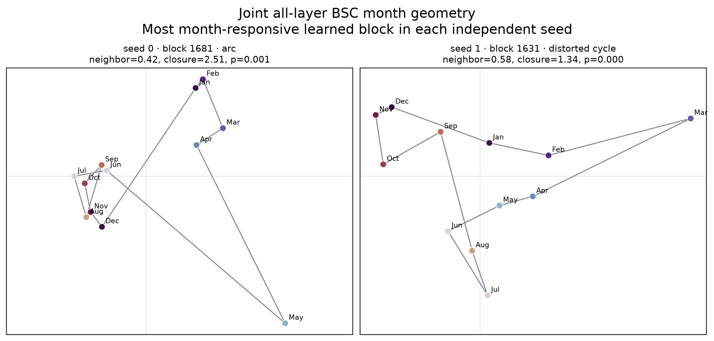
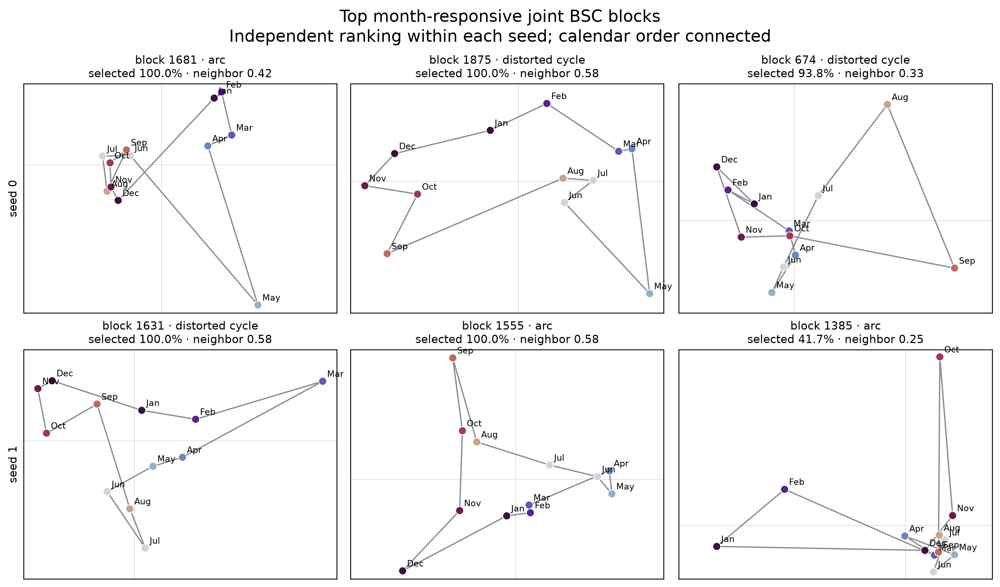

# Findings

This is the scientific report for the BSC campaign. It is organized around
the questions asked, the methods compared, the observed data, and the design
choice that follows.

The evidence cutoff is **2026-07-26 19:32 PDT**. Phase 1 is complete. The
deadline-critical Phase 2 BSC path is complete through two-seed 16M
development, untouched confirmation, and controlled feature-geometry
analysis. A post-confirmation development audit has now crossed the remaining
learning-rate and auxiliary-weight choices and closed the upper learning-rate
boundary. Its final none-vs-map-nuclear regularizer comparison is now running.
The six comparator families have completed their declared same-hardware 4M
calibration paths. No 16M comparator panel was run.

For Phase 2, every FVU value is the raw per-seed score averaged over the exact
256, 384, and 512 total-bit/token budgets; lower is better. Tables show seeds
0 and 1 separately, rounded to six decimals.[^metric]

## Bottom line

Phase 1 showed that the BSC method can recover a planted shared vector factor
rather than merely reconstructing its support. On real GPT-2 activations,
architecture, selector, and optimizer tuning produced a two-seed 16M
development FVU of **`0.241956` / `0.243194`**. The exact selected
configuration then reproduced on untouched confirmation at
**`0.237138` / `0.238543`**: both confirmation seeds improved, rather than
merely staying within tolerance.

The feature analysis also produced a real geometric result. Raw GPT-2 month
centroids preserve calendar order at every captured layer and change from an
open arc at blocks 3/5/7 into a closed ring at block 9. The learned BSC does
not force that geometry into one seed-invariant ideal circle: the strongest
joint month block is an arc in seed 0 and a distorted closed cycle in seed 1,
with strongly non-random calendar path length in both.

All six control families also completed their declared 4M calibration. Their
terminal within-family winners span FVU from about `0.301` for the two scalar
BatchTopK controls to about `0.942` for Group Lasso. These are tuned
development controls, not a direct 16M cross-method leaderboard.

A subsequent 4M audit found a further development improvement. Crossing
learning rates `3e-4` and `6e-4` with auxiliary weights 0, `1/32`, and 1
selected **`6e-4` plus weight 1** at **`0.263365` / `0.259766`**, improving
the exact `3e-4` plus weight-1 replay in both seeds. Doubling again to
`1.2e-3` worsened FVU to **`0.271906` / `0.289441`**, bracketing `6e-4`.
The confirmed 16M model remains the current presentation model until the
regularizer audit closes and the changed winner is retrained.

The currently confirmed BSC configuration, with the active audit status
noted, is:

| Surface | Adopted value | Why |
|---|---|---|
| model and sites | GPT-2 Small residual-pre blocks 3/5/7/9 | frozen real-model pilot contract |
| normalization | scalar RMS | retained deployable gauge; reproduced on untouched confirmation |
| encoder | joint untied linear, no bias, availability-rescaled site sum | tied Grassmann variants failed; removing initialization preconditioning was too small an improvement |
| decoder | free-scale-controlled, no bias, concatenated-L2 block geometry | selected parent remained strongest valid architecture |
| site factorization | rank 4 | noninferior to the full carrier and preferred by parsimony |
| code | signed, 2,048 groups × width 4, 8 active blocks | width 4 won; 32 active coordinates remains the only fully qualified BSC activity setting so far |
| score and selector | decoded energy + block BatchTopK | clear improvement over token-TopK and other score functions |
| site masking | none | every positive masking treatment was worse |
| optimizer | fused Adam, batch 512; confirmed 16M LR `3e-4`; audited 4M LR `6e-4` | `6e-4` beat `3e-4` under all three auxiliary settings; `1.2e-3` then lost in both seeds |
| schedule | final-fifth linear decay to zero | better than constant in both seeds |
| warmup | 0% | clearly better than 2% in both seeds, so the conditional 1% arm was elided |
| regularizer | none | current finalist setting; direct none-vs-map-nuclear audit is running |
| auxiliary | SASA-style frequency-dead residual, weight 1, AuxK 8, `1e-4` dead frequency, 1,000-token window | re-ablated at both `3e-4` and `6e-4`; weight 1 won against zero and `1/32` in every seed |
| train budget | 16M unique rows and optimizer-token presentations | qualified in both development and untouched confirmation seeds |

This table describes the deadline-selected, confirmed 16M model. The active
post-confirmation audit can replace it only after a fresh 16M development
retrain and untouched confirmation. Neither result is yet the five-seed
Phase 3 publication panel.

## Phase 1: does BSC identify a shared vector factor?

**Question.** Can one width-two BSC block recover a planted rank-two vector
factor shared across four independently rotated sites, rather than succeeding
only by reconstructing support?

**Baseline and controls.** The matched one-site instrument checked that the
learner could recover the easy local factor. The four-site carrier then tested
the actual shared-coordinate claim. `support_only` and `site_span_one` were
negative controls for support recovery without the full shared vector
geometry.

| Method | Seed 0 | Seed 1 | Seed 2 | Read |
|---|---:|---:|---:|---|
| one-site matched instrument | pass | pass | pass | local learner and metric are functional |
| four-site shared-coordinate carrier | 0.999600 | 1.000000 | 0.997600 | worst normalized identification margin; passed every seed |
| matched confirmation rerun | pass | pass | pass | native, deployed-codec, and conjunctive gates all passed |
| `support_only` control | fail | fail | fail | support alone did not masquerade as factor recovery |
| `site_span_one` control | conjunctive fail | conjunctive fail | conjunctive fail | recovered its narrow one-span target but not the full four-site factor |

**Interpretation.** The positive carrier and both negative controls behaved as
the truth-known contract predicted. This supports the BSC method semantics:
shared signed coordinates, all-site encoder fusion, calibrated thresholding,
and squared-L2 reconstruction.

**Adopted for Phase 2.** Carry forward the method semantics only. Phase 1 did
not export a model architecture, optimizer, width, activity, score,
regularizer, or rate winner; all of those were reopened on real data.

## Phase 2 setup

The real-model pilot captures four 768-dimensional GPT-2 Small residual
streams on OpenWebText, with disjoint normalization, codec-calibration,
development, confirmation, and training rows.[^setup]

The selection rule is:

1. compute raw-space FVU at 256, 384, and 512 total bits/token;
2. average the three fixed-rate values within each seed;
3. require both development seeds to qualify;
4. aggregate candidates by median, then worst seed;
5. select the numerical winner during boundary refinement.

Development and confirmation use the standard all-view crosscoder objective.
Operational missing-view reconstruction is outside the claim and is not part
of the active evaluation.

## BSC development

### Architecture and capacity

**Question.** Which BSC carrier should be tuned further?

**Baseline.** The starting carrier was the preconditioned joint-untied BSC at
width 4, 32 active coordinates, and the initial capacity.

**Architecture results.**

| Architecture | Seed 0 | Seed 1 | Outcome |
|---|---:|---:|---|
| preconditioned joint-untied parent | 0.400999 | 0.402115 | adopted |
| same model without initialization preconditioning | 0.400750 | 0.401769 | numerically better by only 0.00025/0.00035; below the 0.002 effect floor |
| tied Grassmann width 4 | failed | failed | no qualified comparison |
| tied Grassmann width 4 with polar retraction | failed | failed | no qualified comparison |

**Capacity results.**

| Capacity treatment | Seed 0 | Seed 1 | Outcome |
|---|---:|---:|---|
| parent: width 4, 32 active coordinates | 0.400999 | 0.402115 | adopted |
| half capacity | 0.410877 | 0.408604 | worse |
| width 8 | 0.438543 | 0.440345 | worse |
| scalar width 1 | 0.545655 | 0.544672 | worse |
| double capacity | qualified | failed | seed-incomplete |
| width 2 | failed | qualified | seed-incomplete |
| half activity | qualified | failed | seed-incomplete |
| double activity | qualified | failed | seed-incomplete |

A later clean family-width comparison again favored width 4 over widths 8 and
1. Width 2 again failed one seed.

**Interpretation.** The architecture alternatives did not justify replacing
the parent. Increasing width hurt reconstruction at a fixed total rate, while
several capacity/activity changes were numerically unstable enough to fail
the complete-seed contract.

**Adopted.** Keep the preconditioned joint-untied carrier at width 4 and 32
active coordinates. The activity alternatives remained seed-incomplete, so
the complete parent is retained for the finalist.

### Site factorization and missing-site training

**Question.** How much site-axis rank is needed, and does masking sites during
training improve the joint code?

**Site-rank results.**

| Site factorization | Seed 0 | Seed 1 | Selection read |
|---|---:|---:|---|
| unfactorized carrier | 0.400999 | 0.402115 | numerical control |
| rank 1 | 0.995773 | 0.773756 | much worse |
| rank 2 | 0.667356 | 0.676648 | much worse |
| rank 4 | 0.405323 | 0.405399 | noninferior to carrier; simplest acceptable rank |
| full-rank factorization | 0.408113 | 0.409738 | slightly worse than rank 4 |

**Masking results.**

| Training view | Seed 0 | Seed 1 | Read |
|---|---:|---:|---|
| all sites, no masking | 0.405323 | 0.405399 | best |
| Bernoulli mask `p=0.02` | 0.405975 | 0.405622 | no improvement |
| Bernoulli mask `p=0.05` | 0.408117 | 0.407060 | worse |
| Bernoulli mask `p=0.10` | 0.412169 | 0.409951 | worse |
| exactly one hidden site | 0.418453 | 0.414067 | worse |
| exactly one retained site | 0.471264 | 0.467531 | worst |

**Interpretation.** Rank 4 gives almost all of the carrier's reconstruction
quality at much lower site-axis complexity. Training for partial views did
not improve the standard all-view crosscoder objective and degraded steadily
with stronger masking.

**Adopted.** Rank 4 with zero masking.

### Score, selector, and learned thresholding

**Question.** Which hard-selection rule best allocates sparse blocks, and can
a learned Group-L21 threshold replace hard selection?

**Score × selector results.**

| Score | Selector | Seed 0 | Seed 1 | Read |
|---|---|---:|---:|---|
| decoded energy | block BatchTopK | 0.388467 | 0.387604 | best; adopted |
| isolated loss decrease | block BatchTopK | 0.399089 | 0.398394 | improvement over parent, but weaker |
| decoded energy | token-TopK | 0.405323 | 0.405399 | reproduced parent |
| code norm | block BatchTopK | 0.404275 | 0.403634 | effect too small |
| code norm | token-TopK | 0.406864 | 0.403443 | inconsistent and too small |
| isolated loss decrease | token-TopK | 0.407320 | 0.407620 | worse |

**Learned group-threshold results.**

| Method | Seed 0 | Seed 1 | Read |
|---|---:|---:|---|
| hard decoded-energy BatchTopK parent | 0.388467 | 0.387604 | retained |
| Group-L21 coefficient `3e-4` | 0.967436 | 0.967406 | failed badly |
| Group-L21 coefficient `1e-3` | 0.966761 | 0.966706 | failed badly |
| Group-L21 coefficient `3e-3` | 0.965483 | 0.965350 | failed badly |

**Interpretation.** The important gain comes from allocating blocks across
the batch using decoder-aware energy. Soft group thresholding did not merely
lose narrowly; it collapsed reconstruction across the entire coefficient
range.

**Adopted.** Decoded-energy block BatchTopK, with no learned group threshold.

### Optimizer and schedule

**Question.** Which optimizer scale and schedule convert the architectural
carrier into a strong reconstruction model?

| Trial | Option | Seed 0 | Seed 1 | Decision |
|---|---|---:|---:|---|
| learning rate | `1e-4` parent | 0.388467 | 0.387604 | baseline |
| learning rate | `3e-4` | 0.316867 | 0.316338 | adopt |
| learning rate | `3e-5` | 0.510105 | 0.511283 | reject |
| batch tokens | 4,096 parent | 0.316867 | 0.316338 | baseline |
| batch tokens | 2,048 | 0.304219 | 0.302914 | adopt |
| batch tokens | 8,192 | 0.340716 | 0.336502 | reject |
| warmup | 5% parent | 0.304219 | 0.302914 | baseline |
| warmup | 2% | 0.300071 | 0.299184 | adopt |
| warmup | 10% | 0.308331 | 0.307099 | reject |
| schedule | constant | 0.300071 | 0.299184 | reject |
| schedule | final-fifth linear decay | 0.296505 | 0.297540 | adopt; better in both seeds |
| schedule | cosine decay | 0.319408 | 0.320325 | reject |
| LR revisit | `3e-4` | 0.300071 | 0.299184 | retained |
| LR revisit | `1e-4` | 0.352483 | 0.351713 | reject |
| LR revisit | `3e-5` | 0.457663 | 0.456957 | reject |
| final-fifth batch boundary | 2,048 parent | 0.296505 | 0.297540 | baseline |
| final-fifth batch boundary | 1,024 | 0.290125 | 0.291713 | better |
| final-fifth batch boundary | 512 | 0.287781 | 0.289787 | adopt |
| final-fifth batch boundary | 256 | 0.291038 | 0.290427 | worse; closes the lower boundary |
| final-fifth warmup boundary | 2% | 0.287781 | 0.289787 | baseline at selected batch |
| final-fifth warmup boundary | 0% | 0.282590 | 0.281399 | adopt |

**Interpretation.** Optimization, not architectural complexity, produced the
largest improvement in the main chain. The higher learning rate and smaller
BatchTopK comparison pool were robust in both seeds. The original fixed ladder
stopped while learning rate, batch size, and warmup were still winning at
tested boundaries. Final-fifth improves both seeds over constant. Reducing the
BatchTopK pool from 2,048 to 1,024 improved FVU by `0.006380` and `0.005827`;
512 improved by a further `0.002343` and `0.001926`. The next halving to 256
lost `0.003257` and `0.000640`, so 512 is the first bracketed batch optimum.
At batch 512, removing warmup improved FVU by `0.005192` and `0.008388`.

**Boundary choices retained.** Batch 512, zero warmup, and final-fifth linear
decay. Because 0% warmup clearly won both seeds, the conditional 1% arm was
not needed.

#### Crossed learning-rate and auxiliary audit

**Question.** After the batch, warmup, and schedule boundaries were fixed, did
the previously selected `3e-4` learning rate and weight-1 frequency-dead
residual auxiliary remain optimal when tested together?

**Baseline and alternatives.** The audit crossed learning rates `3e-4` and
`6e-4` with auxiliary weights 0, `1/32`, and 1. All twelve cells used the
same 4M development rows, batch 512, zero warmup, final-fifth decay, no
regularizer, and the selected BSC architecture.

| Learning rate | Auxiliary weight | Seed 0 | Seed 1 | Read |
|---:|---:|---:|---:|---|
| `3e-4` | 0 | 0.282590 | 0.281399 | weakest at this rate |
| `3e-4` | `1/32` | 0.278771 | 0.279012 | intermediate |
| `3e-4` | 1 | 0.264984 | 0.262664 | best at this rate |
| `6e-4` | 0 | 0.279534 | 0.279670 | improves both seeds over `3e-4` |
| `6e-4` | `1/32` | 0.277604 | 0.277322 | improves both seeds over `3e-4` |
| `6e-4` | 1 | **0.263365** | **0.259766** | numerical winner |
| `1.2e-3` | 1 | 0.271906 | 0.289441 | worse in both seeds; closes upper boundary |

**Interpretation.** The auxiliary result is decisive and consistent: weight 1
beats `1/32` and zero at both learning rates and in both seeds. At `6e-4`,
weight 1 improves over no auxiliary by `0.016169` and `0.019904` FVU. The
learning-rate result is also consistent across the complete interaction
surface: `6e-4` beats `3e-4` at every auxiliary weight in both seeds. On the
winning weight-1 arm, the improvements are `0.001619` and `0.002898`.

**Adopted.** Weight 1 and learning rate `6e-4` for the remaining finalist
audit. The next geometric boundary, `1.2e-3`, loses by `0.008541` and
`0.029675` FVU, so `6e-4` is bracketed between the inferior `3e-4` and
`1.2e-3` settings. The larger seed-1 failure also shows that the boundary is
not a marginal tie. Confirmation evidence was not used for this choice.

### Full-budget development

**Question.** Does the boundary-selected optimizer still deliver when the BSC
is trained at the full 16M-row budget?

| Evidence | Seed 0 | Seed 1 | Mean |
|---|---:|---:|---:|
| boundary-selected 4M no-auxiliary parent | 0.282590 | 0.281399 | 0.281994 |
| 4M replay of confirmed `3e-4`, weight-1 configuration | 0.264984 | 0.262664 | 0.263824 |
| adopted 4M audit winner: `6e-4`, weight 1 | 0.263365 | 0.259766 | **0.261565** |
| confirmed 16M development finalist: `3e-4`, weight 1 | 0.241956 | 0.243194 | **0.242575** |

**Interpretation.** The original 4M boundary parent did not yet include the
auxiliary, so it is not an exact scaling control for the 16M finalist. The
post-confirmation audit supplies the missing exact 4M replay: at `3e-4` and
weight 1, moving from 4M to 16M improves FVU by `0.023027` and `0.019470`.
The new 4M `6e-4` winner has not yet been trained at 16M.

**Current decision.** The two-seed `3e-4` 16M model remains the confirmed
Phase 2 development finalist. Retrain at 16M only after the learning-rate and
regularizer audits identify one complete changed development winner.

## Confirmation on untouched data

**Question.** Does the boundary-refined, final-fifth BSC reproduce on untouched
scalar-RMS confirmation data?

| Evidence | Seed 0 | Seed 1 | Mean |
|---|---:|---:|---:|
| 16M development | 0.241956 | 0.243194 | 0.242575 |
| untouched confirmation | 0.237138 | 0.238543 | **0.237841** |

**Interpretation.** Confirmation improves on development by `0.004819` and
`0.004650` FVU. The result therefore clears the most important deadline gate:
the selected BSC is not a development-only numerical winner.

**Status.** This exact `3e-4` 16M configuration remains the confirmed
presentation model. If the post-confirmation development audit changes the
final configuration, its fresh 16M retrain must pass a new untouched
confirmation run before replacing this result.

## Feature geometry across layers

**Question.** What shape do semantic manifolds take in the selected shared
BSC code, and does that geometry change across GPT-2 layers?

**Probe.** Twelve neutral prompt templates were crossed with all twelve
single-token month names. At each month token, the analysis captured the four
selected GPT-2 residual streams, subtracted each template's across-month mean,
and averaged over templates. Raw residual panels use layerwise PCA followed by
orthogonal Procrustes alignment to block 9. BSC panels use each layer's
contribution to one learned width-four block in its native shared coordinate
system; layers are never rotated independently. Each seed selects its own most
month-responsive block using month contrast, absolute response energy, and
actual BatchTopK selection frequency.[^geometry]

**Raw GPT-2 geometry.**

| Layer | Calendar-neighbor recall | Closure ratio | Cyclic distance correlation | Cycle-path p | Read |
|---|---:|---:|---:|---:|---|
| block 3 | 0.875 | 1.790 | 0.863 | <0.0001 | arc |
| block 5 | 0.875 | 1.924 | 0.882 | <0.0001 | arc |
| block 7 | 0.917 | 1.895 | 0.873 | <0.0001 | arc |
| block 9 | 0.917 | 1.722 | 0.860 | <0.0001 | ring |

The striking result is not “months form a ring” simpliciter. Calendar order is
already strong at block 3, but December-to-January remains an open seam through
blocks 3/5/7. The seam closes enough to meet the declared ring read only at
block 9. Meanwhile, the variance captured by the first two dimensions rises
from 39.2% to 43.4%.

**Learned BSC geometry.** The highest-response block is active in 100% of the
probe rows under the trained BatchTopK selector in both seeds, but the
factorization is not identical across random initializations.

| Read | Seed 0, block 1681 | Seed 1, block 1631 |
|---|---:|---:|
| joint geometry | arc | distorted cycle |
| calendar-neighbor recall | 0.417 | 0.583 |
| closure ratio | 2.514 | 1.338 |
| cyclic distance correlation | 0.305 | 0.394 |
| cycle-path p | 0.00115 | <0.0001 |

Seed 0 remains an arc at all four per-layer encoder contributions. Seed 1 is a
distorted closed cycle at blocks 3/5/7, then reopens into an arc at block 9.
The 3D views show that these are not artifacts of independently chosen 2D
rotations: the BSC panels share one width-four projection basis within each
seed.

**Interpretation.** The positive result is calendar topology rather than a
perfect Euclidean circle. Raw GPT-2 residuals show a clean layer-dependent
arc-to-ring transition. The BSC discovers blocks whose calendar traversal is
far shorter than random label orderings and whose activation survives hard
selection, but independent seeds choose different block bases and express the
cycle as an arc or a distorted loop. BSC therefore preserves meaningful
manifold structure without making a seed-stable, canonical-circle claim.

The complete 2D/3D coordinates, top-block rankings, selection frequencies, and
metric definitions are retained in
[`month_geometry_metrics.json`](figures/phase2/month_geometry_metrics.json).

## Comparator-family development

These branches ask a different question from the BSC main chain: how strong
does each comparator become after receiving its own appropriate tuning? All
six declared 4M calibration paths are now selection-complete. Their scores
describe tuned development controls; they are not final method results because
the controls were not retrained at 16M or evaluated on confirmation.

### 1M starting baselines

| Family | Seed 0 | Seed 1 | Mean |
|---|---:|---:|---:|
| BSF Grassmannian | 0.813115 | 0.821469 | 0.817292 |
| BSF Group Lasso | 0.966073 | 0.966031 | 0.966052 |
| SASA | 0.550638 | 0.547401 | 0.549020 |
| Anthropic dense-L1 bridge | 0.938735 | 0.938963 | 0.938849 |
| decoder-weighted BatchTopK | 0.559838 | 0.560133 | 0.559986 |
| scalar ReLU BatchTopK | 0.769379 | 0.770003 | 0.769691 |

These are starting points only. The large changes below show why ranking
methods at the root would be misleading.

### Width calibration

| Family | Width | Seed 0 | Seed 1 | Within-family read |
|---|---:|---:|---:|---|
| BSF Grassmannian | 2 | 0.565261 | 0.574003 | second |
| BSF Grassmannian | 4 | 0.554592 | 0.564405 | adopt |
| BSF Grassmannian | 8 | 0.647661 | 0.652169 | worse |
| BSF Group Lasso | 2 | 0.954693 | 0.954702 | adopt |
| BSF Group Lasso | 4 | 0.965994 | 0.965992 | worse |
| BSF Group Lasso | 8 | 0.974590 | 0.974491 | worse |
| SASA | 2 | 0.378765 | 0.381171 | adopt |
| SASA | 4 | 0.385355 | 0.387029 | second |
| SASA | 8 | 0.426618 | 0.427655 | worse |

**Interpretation.** Every block control preferred a relatively narrow block.
Grassmannian selected width 4; Group Lasso and SASA selected width 2. The
result argues against assuming that more coordinates per block buy better
fixed-rate reconstruction.

### Activity calibration

**Question.** At a fixed family architecture and width, how many active
coordinates produce the best fixed-rate reconstruction?

**Baseline and alternatives.** Each family reran its current activity setting
beside the declared lower- and higher-activity alternatives. The Grassmannian
round added here uses its selected width-4 parent at 32 active coordinates as
the baseline.

| Family | Active coordinates | Seed 0 | Seed 1 | Within-family read |
|---|---:|---:|---:|---|
| BSF Grassmannian | 16 | 0.636630 | 0.679368 | worst |
| BSF Grassmannian | 32 | 0.554592 | 0.564405 | baseline |
| BSF Grassmannian | 64 | 0.547015 | 0.550264 | adopt |
| decoder-weighted BatchTopK | 16 | 0.347461 | 0.348243 | adopt |
| decoder-weighted BatchTopK | 32 | 0.472189 | 0.473224 | worse |
| decoder-weighted BatchTopK | 64 | 0.716090 | 0.716882 | worst |
| scalar ReLU BatchTopK | 16 | 0.501047 | 0.502784 | adopt |
| scalar ReLU BatchTopK | 32 | 0.581384 | 0.581395 | worse |
| scalar ReLU BatchTopK | 64 | 0.770880 | 0.771770 | worst |
| BSF Group Lasso | 16 | 0.972832 | 0.972830 | worst |
| BSF Group Lasso | 32 | 0.954693 | 0.954702 | second |
| BSF Group Lasso | 64 | 0.946401 | 0.946282 | adopt |
| SASA | 16 | 0.446591 | 0.445930 | second |
| SASA | 32 | 0.378765 | 0.381171 | adopt |
| SASA | 64 | 0.608029 | 0.613059 | worst |
| Anthropic dense-L1 | 16 | 0.940578 | 0.940559 | worse |
| Anthropic dense-L1 | 32 | 0.925101 | 0.924799 | adopt |
| Anthropic dense-L1 | 64 | 0.937342 | 0.937187 | worse |

**Interpretation.** Activity is method-dependent. Grassmannian and Group Lasso
improve through 64 coordinates; the two BatchTopK scalar controls strongly
favor 16; SASA and dense-L1 favor 32. Grassmannian adopts 64, improving both
seeds over its 32-coordinate baseline.

### Learning-rate calibration

**Question.** After each family selected its early structural settings, which
learning rate best converts those settings into reconstruction quality?

**Baseline and alternatives.** The current family parent used `1e-4`. Each
round compared `3e-5`, `1e-4`, `2e-4`, and `3e-4` at the same 4M-token budget.

| Family | Learning rate | Seed 0 | Seed 1 | Within-family read |
|---|---:|---:|---:|---|
| decoder-weighted BatchTopK | `3e-5` | 0.452081 | 0.453606 | worst |
| decoder-weighted BatchTopK | `1e-4` | 0.347461 | 0.348243 | baseline |
| decoder-weighted BatchTopK | `2e-4` | 0.318504 | 0.317965 | second |
| decoder-weighted BatchTopK | `3e-4` | 0.306748 | 0.306378 | adopt |
| scalar ReLU BatchTopK | `3e-5` | 0.708557 | 0.708556 | worst |
| scalar ReLU BatchTopK | `1e-4` | 0.501047 | 0.502784 | baseline |
| scalar ReLU BatchTopK | `2e-4` | 0.405054 | 0.406821 | second |
| scalar ReLU BatchTopK | `3e-4` | 0.366868 | 0.370329 | adopt |
| BSF Grassmannian | `3e-5` | 0.689111 | 0.690316 | worst |
| BSF Grassmannian | `1e-4` | 0.547015 | 0.550264 | adopt |
| BSF Grassmannian | `2e-4` | 0.563507 | 0.546668 | seed-discordant |
| BSF Grassmannian | `3e-4` | 0.583864 | 0.544035 | seed-discordant |
| BSF Group Lasso | `3e-5` | 0.947895 | 0.947836 | worst |
| BSF Group Lasso | `1e-4` | 0.946193 | 0.946093 | baseline |
| BSF Group Lasso | `2e-4` | 0.943768 | 0.943541 | second |
| BSF Group Lasso | `3e-4` | 0.942353 | 0.942001 | adopt |
| Anthropic dense-L1 | `3e-5` | 0.938885 | 0.939382 | worst |
| Anthropic dense-L1 | `1e-4` | 0.925072 | 0.924810 | baseline |
| Anthropic dense-L1 | `2e-4` | 0.918056 | 0.917556 | second |
| Anthropic dense-L1 | `3e-4` | 0.915838 | 0.914834 | adopt |

**Interpretation.** Both scalar BatchTopK controls improve monotonically over
the tested range and adopt `3e-4`: decoder-weighted BatchTopK improves its mean
from about `0.34785` to `0.30656`, and scalar ReLU improves from about
`0.50192` to `0.36860`. Dense-L1 also improves monotonically, though it
remains in a much higher-FVU regime: its mean falls from about `0.92494` at
the baseline to `0.91534` at `3e-4`. Group Lasso also improves monotonically
through `3e-4`, but only from about `0.94614` to `0.94218`; tuning the rate
does not repair its poor absolute reconstruction. Grassmannian is
seed-discordant above `1e-4`: seeds 0 and 1 move in opposite directions, and
the seed-0 degradation dominates the common median-then-worst rule.

**Adopted.** The two scalar controls, Group Lasso, and dense-L1 adopt `3e-4`;
Grassmannian adopts the stable `1e-4`.

### Batch-size calibration

**Question.** At their selected activity and learning rate, how large should
the BatchTopK comparison pool be for the two scalar controls?

**Baseline and alternatives.** Each control compared 2,048, 4,096, and 8,192
batch tokens at the same 4M-token budget. For decoder-weighted BatchTopK,
2,048 was already the selected learning-rate parent. For scalar ReLU
BatchTopK, the learning-rate round had used 8,192.

| Family | Batch tokens | Seed 0 | Seed 1 | Within-family read |
|---|---:|---:|---:|---|
| decoder-weighted BatchTopK | 2,048 | 0.306748 | 0.306378 | retain |
| decoder-weighted BatchTopK | 4,096 | 0.311629 | 0.312291 | worse |
| decoder-weighted BatchTopK | 8,192 | 0.336055 | 0.326738 | worse and seed-skewed |
| scalar ReLU BatchTopK | 2,048 | 0.315028 | 0.314415 | adopt |
| scalar ReLU BatchTopK | 4,096 | 0.329433 | 0.330948 | second |
| scalar ReLU BatchTopK | 8,192 | 0.366868 | 0.370329 | prior parent; worst |

**Interpretation.** Both controls prefer the smallest tested pool. The
decoder-weighted result confirms its selected 2,048-token parent and worsens
as the pool grows. Scalar ReLU changes much more: moving from its 8,192-token
parent to 2,048 improves FVU by about `0.05184` in seed 0 and `0.05591` in
seed 1. The agreement across seeds makes this a substantive calibration
result rather than a tie-break.

**Adopted.** Batch 2,048 for both scalar BatchTopK controls.

### Grassmannian schedule calibration

**Question.** After selecting width 4, 64 active coordinates, and LR `1e-4`,
which schedule best trains the Grassmannian comparator?

**Baseline and alternatives.** The learning-rate round used cosine decay to a
minimum-rate ratio of `0.1`. The schedule round compared a constant rate,
final-fifth linear decay, and cosine decay at the same 4M-token budget.

| Schedule | Seed 0 | Seed 1 | Within-family read |
|---|---:|---:|---|
| constant | 0.527425 | 0.519631 | adopt |
| final-fifth decay | 0.534878 | 0.531042 | second |
| cosine decay | 0.555259 | 0.559218 | worst |

**Interpretation.** Removing decay is a clear two-seed improvement. Relative
to final-fifth decay, constant improves FVU by about `0.00745` in seed 0 and
`0.01141` in seed 1; relative to cosine, the gains are about `0.02783` and
`0.03959`. Thus the schedule inherited during learning-rate calibration was
materially suboptimal for this family.

**Adopted.** Constant learning rate.

### Group-Lasso coefficient calibration

**Question.** Does stronger Group-Lasso pressure improve the selected
width-two, 64-active-coordinate comparator?

**Baseline and alternatives.** Coefficients `3e-4`, `1e-3`, and `3e-3` were
compared at the same architecture, optimizer, and 4M-token budget.

| Coefficient | Seed 0 | Seed 1 | Within-family read |
|---:|---:|---:|---|
| `3e-4` | 0.946475 | 0.946385 | worst |
| `1e-3` | 0.946401 | 0.946282 | second |
| `3e-3` | 0.946193 | 0.946093 | adopt |

**Interpretation.** The ordering is consistent across seeds, but the complete
effect is tiny: increasing the coefficient across a factor of ten improves
FVU by only about `0.00028`–`0.00029`. This does not repair Group Lasso's
poor absolute reconstruction.

**Adopted.** Coefficient `3e-3` as the complete numerical winner, without a
claim of practically meaningful coefficient sensitivity.

### SASA coefficient calibration

**Question.** How much initial sparsity pressure should the selected
width-two, 32-active-coordinate SASA carrier receive?

**Baseline and alternatives.** The source bridge's zero-coefficient parent
was compared with initial ratios `0.01`, `0.03`, and `0.10`, holding the
architecture, activity, optimizer, and 4M-token budget fixed.

| Initial ratio | Seed 0 | Seed 1 | Within-family read |
|---:|---:|---:|---|
| `0` | 0.381764 | 0.384332 | baseline |
| `0.01` | 0.381537 | 0.382812 | small improvement |
| `0.03` | 0.378765 | 0.381171 | adopt |
| `0.10` | 0.382968 | 0.381800 | mixed; aggregate worse than `0.03` |

**Interpretation.** Moderate sparsity pressure helps both seeds, but the
response is not monotone. Ratio `0.03` improves the baseline by about
`0.00300` FVU in seed 0 and `0.00316` in seed 1; increasing it to `0.10`
gives back most of that gain.

**Adopted.** Initial ratio `0.03`, as the complete numerical winner under the
common seed aggregation rule.

### SASA auxiliary calibration

**Question.** Does the selected SASA carrier benefit from its source
dead-residual auxiliary, and if so at what weight and dead-window length?

**Baseline and alternatives.** The source bridge uses a frequency-dead
residual auxiliary at weight 1 with a 1,000-token window. The round compared
that parent with no auxiliary, weight `1/32` at the same window, and weight 1
with a 100,000-token window.

| Auxiliary | Seed 0 | Seed 1 | Within-family read |
|---|---:|---:|---|
| weight `1/32`, 1k window | 0.371954 | 0.374356 | adopt |
| none | 0.376418 | 0.377397 | second |
| source: weight 1, 1k window | 0.378765 | 0.381171 | baseline |
| weight 1, 100k window | 0.397010 | 0.399535 | worst |

**Interpretation.** A small auxiliary weight helps both seeds, improving the
source parent by about `0.00681` FVU in each. Removing the auxiliary entirely
also beats the source parent, so weight 1 is too strong on this calibrated
carrier. Lengthening the dead window is actively harmful, losing about
`0.01825`–`0.01836` against the source.

**Adopted.** Frequency-dead residual auxiliary at weight `1/32`, with the
1,000-token dead window.

### Dense-L1 coefficient calibration

| Coefficient | Seed 0 | Seed 1 | Mean |
|---:|---:|---:|---:|
| `3e-6` | 0.925072 | 0.924810 | **0.924941** |
| `1e-5` | 0.925101 | 0.924799 | 0.924950 |
| `3e-5` | 0.925082 | 0.924833 | 0.924957 |

**Interpretation and adoption.** The panel is essentially flat: the complete
mean spread is about `1.6e-5` FVU. `3e-6` is the deterministic selected value,
not evidence for a practically meaningful coefficient effect.

### Schedule calibration for the remaining scalar controls

**Question.** After activity, learning rate, and BatchTopK pool size were
calibrated, which schedule best trains dense-L1 and the two scalar BatchTopK
controls?

**Baseline and alternatives.** Each family compared a constant learning rate,
final-fifth linear decay to zero, and cosine decay at the same 4M-token budget.
All eighteen cells qualified.

| Family | Schedule | Seed 0 | Seed 1 | Within-family read |
|---|---|---:|---:|---|
| Anthropic dense-L1 | constant | 0.903007 | 0.900963 | adopt |
| Anthropic dense-L1 | final-fifth decay | 0.906638 | 0.905093 | second |
| Anthropic dense-L1 | cosine decay | 0.915838 | 0.914834 | worst |
| decoder-weighted BatchTopK | constant | 0.306748 | 0.306378 | second |
| decoder-weighted BatchTopK | final-fifth decay | 0.301524 | 0.303207 | adopt |
| decoder-weighted BatchTopK | cosine decay | 0.317660 | 0.319659 | worst |
| scalar ReLU BatchTopK | constant | 0.304947 | 0.303965 | second |
| scalar ReLU BatchTopK | final-fifth decay | 0.300033 | 0.301688 | adopt |
| scalar ReLU BatchTopK | cosine decay | 0.318259 | 0.318039 | worst |

**Interpretation.** Schedule preference is method-dependent. Dense-L1 favors
constant rate, improving over final-fifth by `0.003632` and `0.004131` FVU.
Both BatchTopK controls favor final-fifth decay: it improves the
decoder-weighted control over constant by `0.005223` and `0.003171`, and the
scalar-ReLU control by `0.004915` and `0.002278`. Cosine is clearly worst for
all three families.

**Adopted.** Constant rate for dense-L1; final-fifth linear decay for both
scalar BatchTopK controls.

### Selected 4M control configurations

| Family | Adopted 4M configuration | Seed 0 | Seed 1 |
|---|---|---:|---:|
| BSF Grassmannian | width 4; 64 active coordinates; LR `1e-4`; batch 8,192; 5% warmup; constant | 0.527425 | 0.519631 |
| BSF Group Lasso | width 2; 64 active coordinates; coefficient `3e-3`; LR `3e-4`; batch 8,192; 5% warmup; cosine to 10% LR | 0.942353 | 0.942001 |
| SASA | width 2; 32 active coordinates; initial ratio `0.03`; LR `2e-4`; batch 4,096; 5% warmup; final-fifth decay; frequency-dead auxiliary weight `1/32`, 1k window | 0.371954 | 0.374356 |
| Anthropic dense-L1 | 32 active coordinates; coefficient `3e-6`; LR `3e-4`; batch 4,096; 5% warmup; constant | 0.903007 | 0.900963 |
| decoder-weighted BatchTopK | 16 active coordinates; LR `3e-4`; batch 2,048; 5% warmup; final-fifth decay | 0.301524 | 0.303207 |
| scalar ReLU BatchTopK | 16 active coordinates; LR `3e-4`; batch 2,048; 5% warmup; final-fifth decay | 0.300033 | 0.301688 |

These are the authoritative within-family 4M selections. No cross-family
winner is declared: doing so would require a separately authorized common
budget and evaluation panel, which is outside this completed calibration
pass.

## Limitations and open reads

- Phase 2 has two seeds. It is appropriate for conditional tuning, not a
  five-seed publication claim.
- The main chain is path-dependent. The crossed finalist audit closes the
  learning-rate/auxiliary interaction and brackets the learning rate, but the
  final none-vs-map-nuclear regularizer comparison is still pending. The
  search is structured rather than exhaustive.
- Comparator roots use different architectures and source recipes. Their 4M
  tuning is complete, but they were not retrained at the BSC finalist's 16M
  budget or evaluated on confirmation, so this report does not declare a final
  cross-method winner.
- High all-site reconstruction does not prove causal identifiability,
  semantic monosemanticity, or recovery of a global manifold.
- Decoder norm is not specificity, decoder capacity is not used dimension,
  and aggregate reconstruction is not manifold recovery.
- The month probe is controlled and replicated across two trained seeds, but
  it is exploratory rather than a preregistered semantic benchmark. Its
  categorical shape labels summarize declared metrics; they do not prove a
  unique latent ontology.
- Deadline mode deferred broad campaign replay. The exact winning BSC path,
  untouched confirmation, plot inputs, rendered figures, and terminal 4M
  control selections were checked; broader protocol validation remains
  post-deadline work.

[^metric]: Each cell evaluates the measured lower convex rate-distortion envelope at 256, 384, and 512 total bits/token, including fixed-width packet bits and amortized deployable-codec bytes. The schedule is executed on paired raw rows and never extrapolated. Development selection uses seeds 0 and 1, median then worst seed, and complete scientific qualification.

[^setup]: Capture uses `openai-community/gpt2` revision `607a30d783dfa663caf39e06633721c8d4cfcd7e`, OpenWebText revision `b4325f019c648b1641a1784748667e8b74e5e064`, byte BPE, context length 128, and residual-pre hooks at blocks 3, 5, 7, and 9. Split sizes are 250k normalization-fit, 250k codec-calibration, 1M development, 1M confirmation, and 16M training rows, allocated by whole packed sequences. Forward and stored activation precision are bf16.

[^geometry]: Calendar-neighbor recall asks whether each month's two nearest projected neighbors are its calendar neighbors. Closure is the December-to-January distance divided by the mean of the other calendar edges. The cycle-path p-value compares the closed calendar traversal with 20,000 fixed-seed random label permutations. The exploratory `ring` label requires neighbor recall at least 0.625, p at most 0.05, closure at most 1.75, and radial coefficient of variation at most 0.35; `arc` denotes a significant cycle with an open closure.
